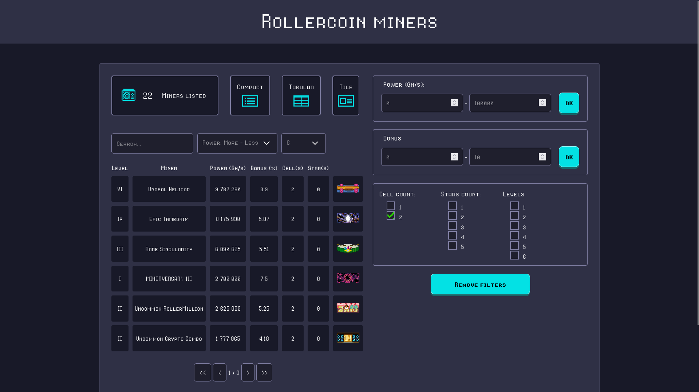

# Rollercoin miners filter

## An additionnal filtering capability tool for Rollercoin miners

  

**https://alainsopp.github.io/All-Rollercoin-Miners/**

This application is intended to provide a complete list of all miners available in the game. 
It comes with a capability of searching and filter on miners with more accuracy. 

**Rollercoin** is providing several ways of filtering on miners.  
Miners have multiple characteristics like **Mining power**, **Price**, **Cell count**, etc.
It is possible to filter on some of them:  

* Name
* Mining power range
* Price range
* Cell count
* Upgrade, witch allows you to search for Basic miners (level I) or Merged miners (level II to VI)

However, some characteristics are not filterable.  
For instance, it is not possible to filter on a miner **Bonus power** wich is another miner characteristic.  
Filtering on an exact miner level (i.e. level II) is not available neither.  
This application add additionnal filters on miner to allow players to search for a desired miner with more
accuracy.  

## Disclaimer

As it is stated in the web site terms of use, it is prohibited to use any automated scripts,  
bots, or other software to interact with the RollerCoin website.  
https://rollercoin.com/terms

## Find a bug or want to improve?

If you found an issue or would like to submit an improvement to this project,   
please submit an issue using the issue tab above.  
If you would like to submit PR with a fix, reference the issue you created.  

## Known issues (Work in progress)

This project is still ongoing, especially the part with completing the list of all miners available in the game.

## Referal program

If you want to join rollercoin, here is my referal link **https://rollercoin.com/?r=lfpqio8r**.  
By signing up with this link, You will receive 1000 free Satoshis.
